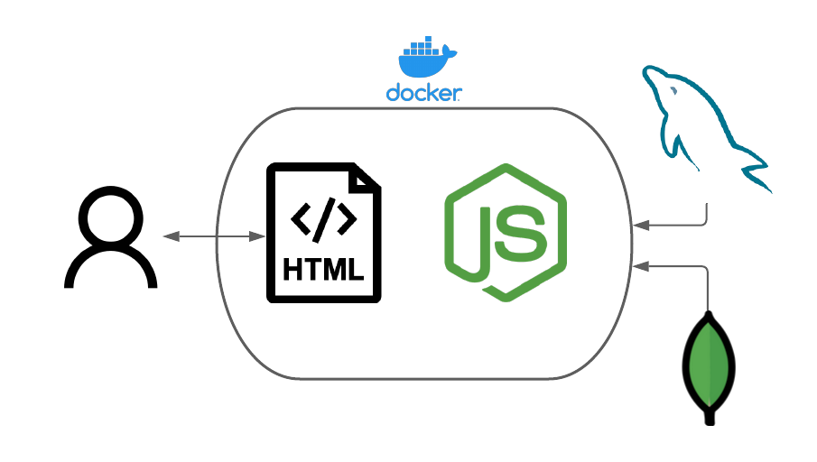

# TC3041 Proyecto Final

# *ValorPass*
---

##### Integrantes:
1. *Luis Emilio Alcántara Guzmán* - *A01027304* - *Campus Santa Fe*
2. *Rodrigo Sibaja Villarreal* - *A01023121* - *Campus Santa Fe*

---
## 1. Aspectos generales

Las orientaciones del proyecto se encuentran disponibles en la plataforma **Canvas**.

Este documento es una guía sobre qué información debe entregar como parte del proyecto, qué requerimientos técnicos debe cumplir y la estructura que debe seguir para organizar su entrega.

### 1.1 Requerimientos técnicos

A continuación se mencionan los requerimientos técnicos mínimos del proyecto, favor de tenerlos presente para que cumpla con todos.

* El equipo tiene la libertad de elegir las tecnologías de desarrollo a utilizar en el proyecto.
* El proyecto debe utilizar al menos dos modelos de bases de datos diferentes, de los estudiados en el curso.
* La arquitectura debe ser modular, escalable, con redundancia y alta disponibilidad.
* La arquitectura deberá estar separada claramente por capas (*frontend*, *backend*, *API RESTful*, datos y almacenamiento).
* Los diferentes componentes del proyecto (*frontend*, *backend*, *API RESTful*, bases de datos, entre otros) deberán ejecutarse sobre contenedores [Docker](https://www.docker.com/) o desplegarse en un servicio en la nube.
* Todo el código, *datasets* y la documentación del proyecto debe alojarse en este repositorio de GitHub siguiendo la estructura que aparece a continuación.

### 1.2 Estructura del repositorio
El proyecto debe seguir la siguiente estructura de carpetas:
```
- /                     # Raíz de todo el proyecto
    - README.md         # Archivo con los datos del proyecto
    - Aplicacion        # Carpeta con FrontEnd, Backend y Schemas de Bases de datos  
    - dbs               # Carpeta con archivos necesarios para creación de ambas bases de datos
- /  Aplicacion
    - Backend	        # Carpeta con la solución de Backend con Express
    - Frontend	        # Carpeta con código HTML, CSS Y JS helpers
    - Schemas	        # Carpeta con los schemas para Base de datos en MongoDB  
 - /  dbs  
    - SQL               #Carpeta con Dump de base de datos para creación y diagrama relacional
    - MongoDB           #Carpeta con json schemas para creacion de colecciones en MongoDB
```

### 1.3 Documentación  del proyecto

Como parte de la entrega final del proyecto, se debe incluir la siguiente información:

* Justificación de los modelo de *bases de datos* que seleccionaron.
* Descripción del o los *datasets* y las fuentes de información utilizadas.
* Guía de configuración, instalación y despliegue de la solución.
* Documentación de la API (si aplica). Puede ver un ejemplo en [Swagger](https://swagger.io/). 
* El código debe estar documentado siguiendo los estándares definidos para el lenguaje de programación seleccionado.

## 2. Descripción del proyecto

El proyecto ValorPass es un sitio web donde los usuarios pueden buscar partidos de los equipos más famosos de Valorant en el mundo, dentro de la página aparecen los juegos pasados, en vivo y que sucederán en un futuro. Dentro de cada de partido se despliega el marcador del partido, un mini reproductor de video donde se hará la transmisión del partido y la alineación de cada equipo junto al personaje que seleccionó cada miembro.

Igualmente se tiene una página de administrador donde pueden agregar a los equipos con todos sus jugadores, actualización de marcador, eliminar partidos, agregar partidos.Esta página solo puede ser accesada por un usuario, a los demás usuarios dentro de la base de datos se les rechazará la entrada a esta sección.

## 3. Solución

A continuación aparecen descritos los diferentes elementos que forman parte de la solución del proyecto.

### 3.1 Modelos de *bases de datos* utilizados

Se utilizaron dos modelos de bases de datos para la realización del proyecto, un problema de negocio utiliza el modelo relacional con MySQL y los otros dos utilizan el modelo orientado a documentos con MongoDB. Se decidió utilizar estos modelos por el conocimiento previo que se tenía de ellos y flexibilidad al momento de utilizarlos para tener una arquitectura modular, escalable, con redundancia y de alta disponibilidad.

Los problemas de negoció a desarrollar fueron los siguientes:  
* Creación y administración de usuarios para el acceso y navegación de la página, los usuarios tienen su propia lista de equipos que sigue para visualizaciones personalizadas.
* Manejo de datos, en este caso información de partidas de Valorant, para su la visualización de estadísticas ordenadas 
* El uso de un usuario administrador capaz de ejecutar las operaciones CRUD, permitiendo la gestion de la base de datos.


### 3.2 Arquitectura de la solución



### 3.3 Frontend

Se decidió representar el frontend a traves de una página web utilizando HTML, CSS y JavaScript. La página web permite el regitro de usuarios para posteriormente accesar a la sección principal de la página en la que podrán visualizar el contenido, en este caso partidos del videojuego Valorant junto con información más específica como estadísticas y los jugadores que participaron, los usuarios también pueden decidir seguir a equipos para obtener una lista de sus partidos. El acceso como administrador permite el uso de una página adicional con campos para añadir nuevos datos a la página.

#### 3.3.1 Lenguaje de programación
JavaScritpt, HTML y CSS

### 3.4 API o backend

El proyecto conecta las bases de datos de MySQL y MongoDB a través de los archivos del backend database.js, index.js, mysql.js y server.js, las primeras tres mencionadas son utilizadas para establecer conexión y la última, como su nombre lo dice, funciona como servidor en el que se ejecutan operaciones de validación, creación, actualización, borrado y lectura para el manejo de solicitudes a lo largo de la página.

#### 3.4.1 Lenguaje de programación
JavaScript
#### 3.4.2 Framework
NodeJS  

#### 3.4.3 Librerías de funciones o dependencias
* Express  
* Bcrypt  
* Mysql  
* Mongoose

#### Endpoints
* **Descripción**: Página para la creación de cuentas, se recibe a los usuarios en esta página.
* **URL**: /index
* **Verbos HTTP**: Get

* **Descripción**: Página para inicio de sesión, valida credenciales y permite el acceso a la página principal.
* **URL**: /signIn
* **Verbos HTTP**: Get
  
* **Descripción**: Página principal del proyecto, muestra el estado de partidas de Valorant que pueden ser consultadas.
* **URL**: /home
* **Verbos HTTP**: Get
  
* **Descripción**: Página de equipos filtrada por quienes sigue el usuario.
* **URL**: /homeFiltered
* **Verbos HTTP**: Get
  
* **Descripción**: Página de información de partida, muestra estadísticas de la partida como puntuación, jugadores y personajes utilizados.
* **URL**: /match
* **Verbos HTTP**: Get
  
* **Descripción**: Página de equipos, se muetran los equipos registrados en la base de datos y permite al usuario seguir equipos o visualizar su historial de partidas.
* **URL**: /teams
* **Verbos HTTP**: Get
  
* **Descripción**: Página de administrador, solo accesible con una cuenta de administrador, permite hacer operaciones CRUD en las bases de datos.
* **URL**: /admin
* **Verbos HTTP**: Get

  
## 3.5 Pasos a seguir para utilizar el proyecto

1.- Descargar el repositorio de Github desde: https://github.com/tec-csf/tc3041-pf-primavera-2021-team6.git
```
 git clone https://github.com/tec-csf/tc3041-pf-primavera-2021-team6.git
```   
2.- Acceder a la carpeta aplicación
```
cd Aplicacion
```   
3.- Crear contenedor 
```
docker build --tag valorpass .  
docker-compose build
```
4.- Iniciar el contenedor
```
docker-compose up
```
5.- Accede a la página utilizando la dirección localhost:4000

6.- Para cerrar el contenedor
```
docker-compose down
```
## 4. Referencias

1. [Conexión con Mongoose](https://mongoosejs.com/docs/guide.html)  
2. [Creación de página web dinámica](https://medium.com/@pearlmcphee/build-a-dynamic-app-using-javascript-html-and-css-f0dfc136007a)  
3. [Creación de sesiones con Express](https://www.youtube.com/watch?v=OH6Z0dJ_Huk&ab_channel=CodeRealm)  
4. [Uso de Fetch request](https://developer.mozilla.org/en-US/docs/Web/API/Fetch_API/Using_Fetch) 
5. [Conexión de SQL con NodeJS](https://www.sitepoint.com/using-node-mysql-javascript-client/)  
